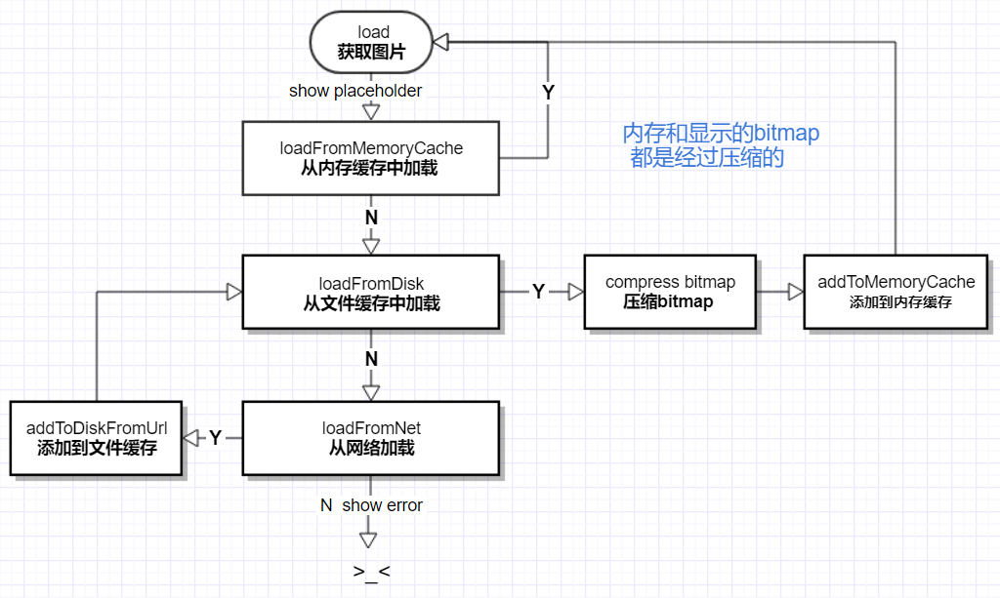

# Android DxIamgeLoader Lib

--------
## 详细解读博客
http://blog.csdn.net/u010072711/article/details/74502822

## 文章导读---------------------------------------------------

Android DiskLruCache完全解析，硬盘缓存的最佳方案 http://blog.csdn.net/guolin_blog/article/details/28863651

Android性能优化之使用线程池处理异步任务 http://blog.csdn.net/u010687392/article/details/49850803

Android开发之高效加载Bitmap http://www.cnblogs.com/absfree/p/5361167.html

Android线程同步 http://blog.csdn.net/peng6662001/article/details/7277851/

## 方法调用顺序-----------------------------------------------

load   -->  placeholder  -->  error  -->  	into


## 图片加载顺序---------------------------------------------

loadFromMemoryCache    成功返回bitmap

loadFromDisk  =》addToMemoryCache  获取成功并压缩后把bitmap添加到运行内存  返回bitmap

     ↑

     <--------------------------------

                                      ↑

loadFromNet  =》  addToDisk   =》 loadFromDisk   网络获取成功后调用loadFromDisk添加到文件缓存(返回压缩的bitmap 并添加到运行内存)

## Sample：
``` java
    //Application中初始化
    public class App extends Application {
        @Override
        public void onCreate() {
            super.onCreate();
            //初始化图片加载库
            DxImageLoader.getInstance().init(getApplicationContext());
        }
    }

    //activity中调用
    /****调用示例***/
    ImageView imageView0 = (ImageView) findViewById(R.id.image0);
    DxImageLoader.getInstance().
    load(imgUrls[0]). //load图片地址
    placeholder(R.drawable.default_pic_loading). //placeholder占位图
    error(R.drawable.app_bg). //error错误图
    into(imageView0);  //into显示图片的imageView
```

## 效果图

